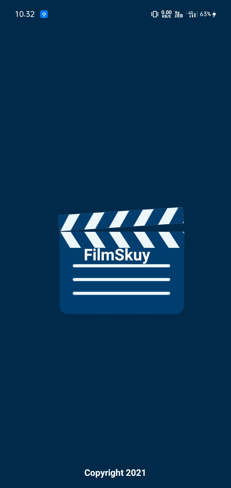
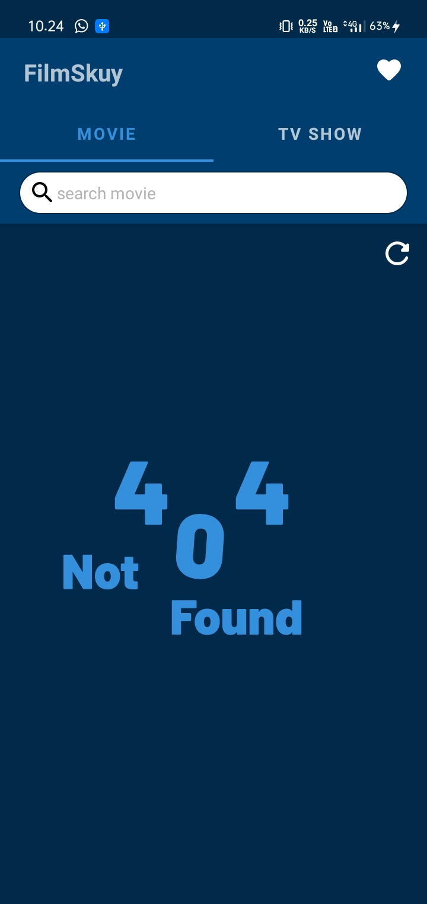
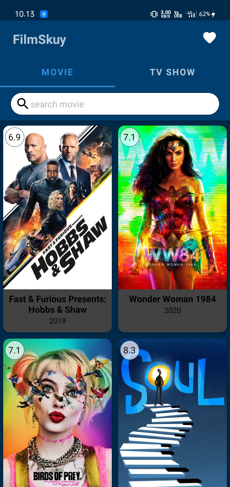
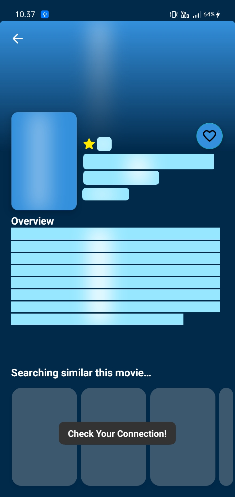
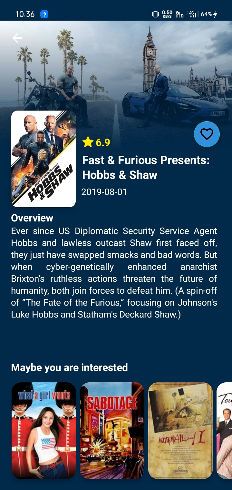
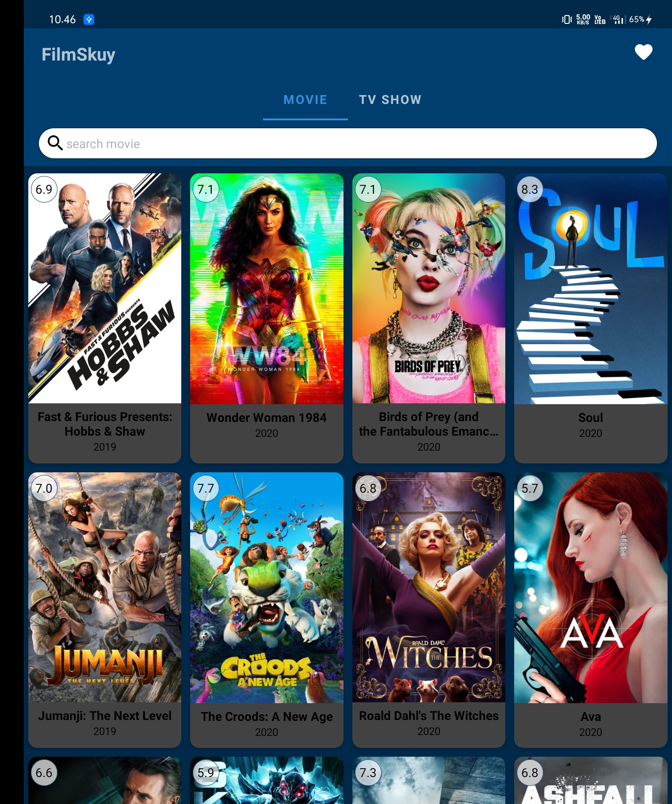
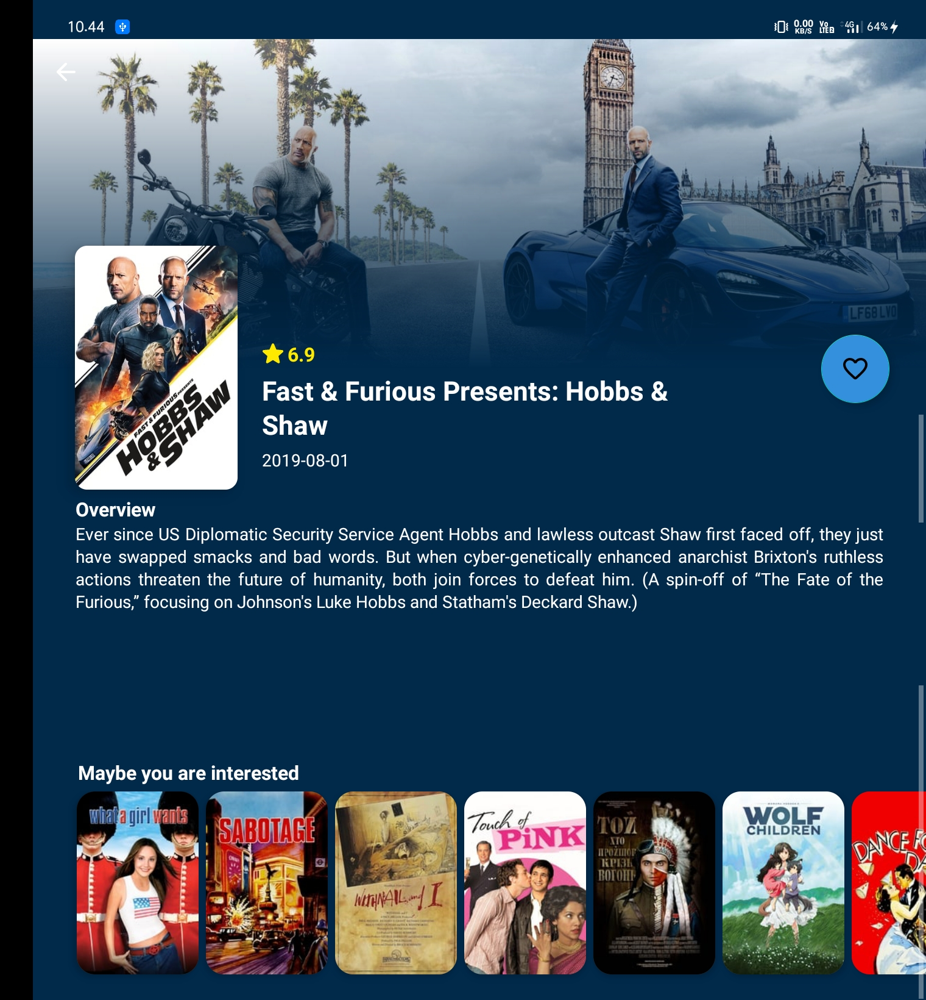

<h1 align="center">FilmSkuy versi 2.0</h1>

## Information Up to date
### CircleCI Status

### Branch Implementation
Branches are sorted by step by step development

## Submission
### Submission1 (Capstone Project1)
**1. Architecture Pattern (Clean Architecture) & Design Pattern** 
**2. Retrofit & Reactive Programming (Coroutine Flow)** 
**3. Dependency Injection (Koin)** 
**4. Modularization (Dynamic Feature)**

### Submission2 (Capstone Project2)
**5. Continuous Integration (CircleCI)** 
**6. Performance**
- Profiling Performance
- GPU Overdrawn
- Android Profiler
- Leak Canary
- Battery Historian

**7. Security**
- Encryption
- Obfuscation
- Certificate Pinning

**8. Build App with Useful Libraries (Lottie & Shimmer)**

## Screenshot Apps

  
  
  

  
  
  

  
  

